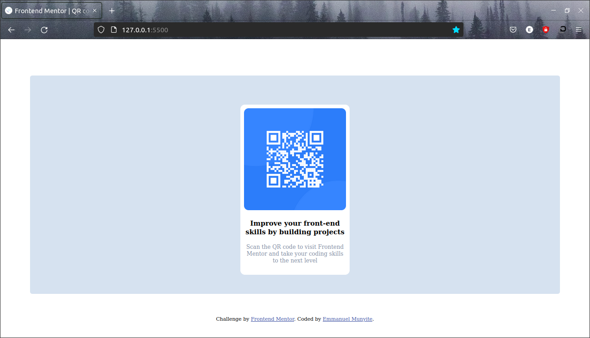
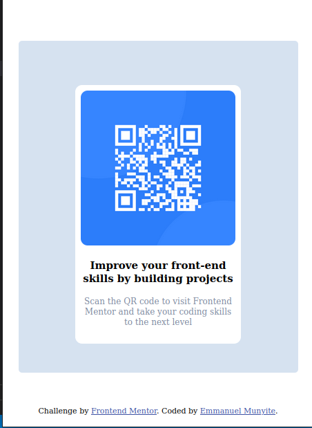

# Frontend Mentor - QR code component solution

This is a solution to the [QR code component challenge on Frontend Mentor](https://www.frontendmentor.io/challenges/qr-code-component-iux_sIO_H). Frontend Mentor challenges help you improve your coding skills by building realistic projects. 

## Table of contents

- [Overview](#overview)
  - [Screenshot](#screenshot)
  - [Links](#links)
- [My process](#my-process)
  - [Built with](#built-with)
  - [What I learned](#what-i-learned)
  - [Continued development](#continued-development)
  - [Useful resources](#useful-resources)
- [Author](#author)
- [Acknowledgments](#acknowledgments)

## Overview
This is the solution for the qr code component challenge from front-end mentor. Solution was developed by Emmanuel Munyite and it took about 2 hours.

### Screenshot
The screenshots for the desktop and mobile designs
Desktop design => 
Mobile design => 

### Links

- Solution URL: [Add solution URL here](https://your-solution-url.com)
- Live Site URL: [Add live site URL here](https://your-live-site-url.com)

## My process
First thing is to analyse and visualise the design in your mind.
Look at all the sections that will be within the design, all the divs, the paragraps etc
Then analyze at the styling of the given preview, the fonts, the colors, the dimensions etc
Then lay the foundations, the paragraphs, the text the different sections etc using html.
Then declare your css variables to use for the styling.
THen applying the styling

### Built with

- Semantic HTML5 markup
- CSS custom properties
- Flexbox
- Mostly just plain old css

### What I learned

- The best way to come up with good designs, is to first analyze the project and visualize it.
- Break down the project into different sections, identifying all the tags that will be used
- It's good to first declare your css variables, to make styling easier, setting up things like primary color, secondary color, backround color, before styling your page, will make styling easier and even more enjoyable

### Continued development

For me the mobile designs have always proven difficult, so in future, I want to continue practising with mobile first designs to make my designs more responsive

## Author

- Github - [Munyite001](https://github.com/munyite001)
- Frontend Mentor - [@munyite001](https://www.frontendmentor.io/profile/munyite001)
- Twitter - [@Emunyite](https://www.twitter.com/Emunyite)
